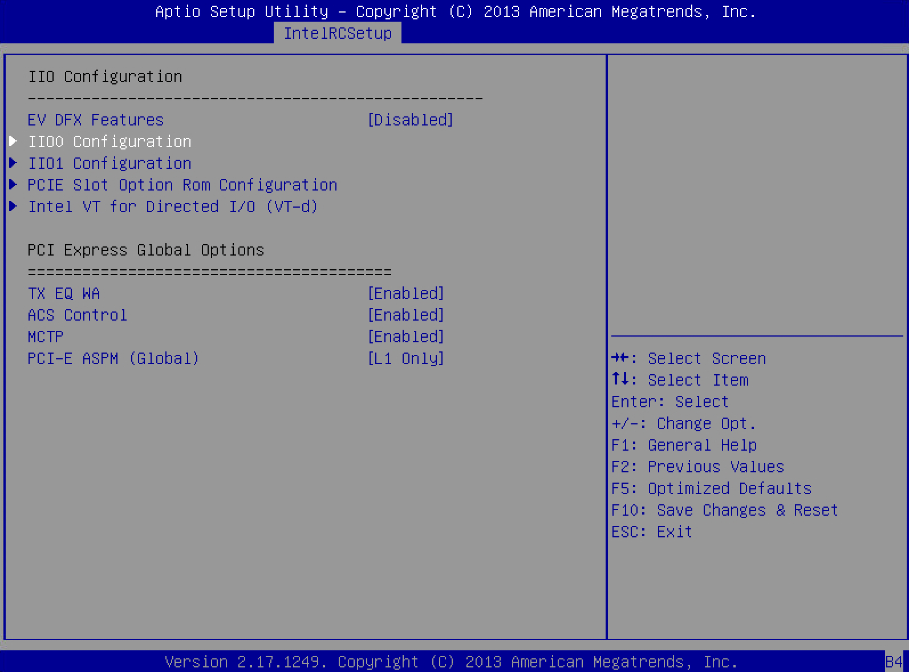
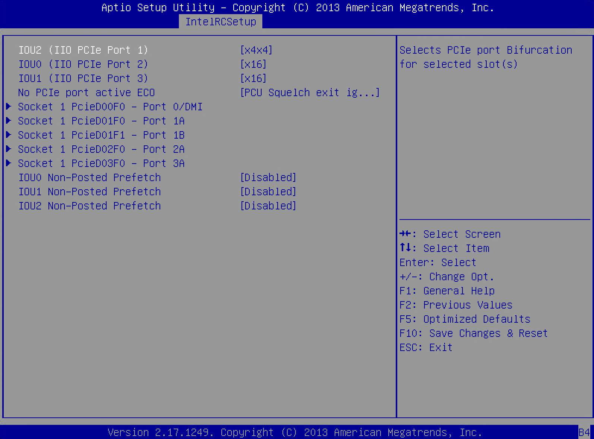

# ASUS Z10PE-D8 WS BIOS unlock (4301)

[](https://github.com/nesvet/z10pe-d8-ws-bios-unlock/actions/workflows/ci.yml)
[](LICENSE)


Unlock **IIO0** and **IIO1 Configuration** (PCIe bifurcation menus) on the **ASUS Z10PE-D8 WS** BIOS **4301**. Use for **x4x4x4x4** on an x16 slot — quad NVMe/M.2 risers, PCIe splitters, and similar adapters.

## What it does

| Does | Does not |
|------|----------|
| Unlock **IIO0** and **IIO1 Configuration** (2-byte AMITSE setupdata patch) | Set bifurcation defaults in firmware |
| Preserve the original ASUS capsule header | Distribute stock or modded `.CAP` files |
| `verify` / `doctor` + optional AMIBCP compare; auto-select profile by stock SHA256 | Replace AMIBCP for arbitrary BIOS edits |

| Menu path | Option | Patch |
|-----------|--------|-------|
| IntelRCSetup → IIO Configuration | **IIO0 Configuration** | access → User |
| IntelRCSetup → IIO Configuration | **IIO1 Configuration** | access → User |

After flashing, set **IOU Link Width** yourself — see [Slot → IOU map](#slot--iou-map).

## Requirements

- [Node.js](https://nodejs.org) ≥ 22.18 (zero-install via `npx`; also used after clone)
- Official **ASUS BIOS 4301** `.CAP` — [Z10PE-D8 WS download (US)](https://www.asus.com/us/supportonly/z10pe-d8%20ws/helpdesk_bios/) or [global support page](https://www.asus.com/supportonly/z10pe-d8%20ws/helpdesk_bios/)
- USB stick (FAT32) for **USB BIOS FlashBack**
- Optional for dev: [Bun](https://bun.com) ≥ 1.3

`npm install` / `bun install` only for [Development](#development) or repeated local runs.

## Quick start

Download the official **4301** `.CAP` from [Requirements](#requirements).

Prefix for all zero-install commands (first run downloads the package from GitHub, ~30s; stock `.CAP` never leaves your machine):

```bash
npx --yes github:nesvet/z10pe-d8-ws-bios-unlock
```

```bash
npx --yes github:nesvet/z10pe-d8-ws-bios-unlock doctor ~/Downloads/Z10PE-D8-WS-ASUS-4301.CAP
npx --yes github:nesvet/z10pe-d8-ws-bios-unlock build ~/Downloads/Z10PE-D8-WS-ASUS-4301.CAP
# → ~/Downloads/Z10PEWS.CAP (FlashBack name — see profiles list)
```

1. Copy **`Z10PEWS.CAP`** to a **FAT32** USB stick.
2. Flash via rear **USB BIOS FlashBack** (PSU on, system off).
3. **Clear CMOS** after the first mod flash.
4. Open **IntelRCSetup** and set **IOU Link Width** for your slot ([Slot → IOU map](#slot--iou-map)).
5. Confirm **POST** and boot. For quad NVMe: `lspci | grep -i nvme` — four separate controllers.

Optional explicit output:

```bash
npx --yes github:nesvet/z10pe-d8-ws-bios-unlock build ~/Downloads/stock.CAP -o ~/Desktop/Z10PEWS.CAP
```

List registered profiles:

```bash
npx --yes github:nesvet/z10pe-d8-ws-bios-unlock profiles list
```

If your stock file is already named `Z10PEWS.CAP`, output defaults to **`Z10PEWS-unlock.CAP`** — see [FAQ](#my-stock-file-is-already-named-z10pewscap).

## Slot → IOU map

Physical slots are numbered **PCIE 1–7** on the silkscreen ([ASUS manual](https://dlcdnets.asus.com/pub/ASUS/mb/Socket2011-R3/Z10PE-D8_WS/Manuals/E15493_Z10PE-D8_WS_UM_V7_WEB.pdf) §2.5.4–2.5.5). **IIO0** = first socket (CPU1), **IIO1** = second socket (CPU2).

**BIOS path (same for every IOU):** IntelRCSetup → IIO Configuration → **IIO0** or **IIO1 Configuration** → **IOUx** → **IOU Link Width**.

Open the top-level **IntelRCSetup** tab (not under Advanced). You should see **IIO0 Configuration** and **IIO1 Configuration** under **IIO Configuration**:



Inside **IIO0 Configuration** (CPU1), **IOU Link Width** controls bifurcation. Stock **4301** defaults:



**IIO PCIe Port N** in setup is numbered **1–3 inside each IIO** — it is **not** the silkscreen slot number. Use the **IOU** column below.

One row per physical connector. An **IOU serves a pair of slots** (or the onboard M.2); change **one** IOU to **x4x4x4x4** for a quad x16 riser and leave the others at stock (do not mass-switch to Auto). Stock values are from BIOS **4301** defaults.

| Connector | CPU | Max lanes | IIO | IOU | Menu label | Stock (4301) | Confidence |
|-----------|-----|-----------|-----|-----|------------|--------------|------------|
| Slot **1** | CPU1 | x16* | IIO0 | **IOU0** | IIO PCIe Port 2 | x16 | derived |
| Slot **2** | CPU1 | x8 | IIO0 | **IOU0** | IIO PCIe Port 2 | x16 | derived |
| Slot **3** | CPU1 | x16* | IIO0 | **IOU1** | IIO PCIe Port 3 | x16 | **verified** |
| Slot **4** | CPU1 | x8 | IIO0 | **IOU1** | IIO PCIe Port 3 | x16 | derived |
| Onboard **M.2 (NGFF1)** | CPU1 | x8 | IIO0 | **IOU2** | IIO PCIe Port 1 | x4x4 | **verified** |
| Slot **5** | CPU2 | x16 | IIO1 | **IOU0** | IIO PCIe Port 2 | x16 | **verified** |
| Slot **6** | CPU2 | x8 | IIO1 | **IOU2** | IIO PCIe Port 1 | x8 | **verified** |
| Slot **7** | CPU2 | x16 | IIO1 | **IOU1** | IIO PCIe Port 3 | x16 | derived |

\*Slots **1** and **3** run at full **x16** only when the adjacent x8 slot (**2** or **4**) is empty; otherwise they drop to **x8** ([manual](https://dlcdnets.asus.com/pub/ASUS/mb/Socket2011-R3/Z10PE-D8_WS/Manuals/E15493_Z10PE-D8_WS_UM_V7_WEB.pdf) §2.5.4). Stock **x16** on silkscreen x8 slots **2**/**4** is the root-port width in setup, not the silkscreen label.

**IOU2** (PCIe Port 1) is x8 max — BIOS options are only `Auto` / `x8` / `x4x4`. There is **no** `x4x4x4x4` on IOU2. On IIO0, IOU2 feeds the **onboard M.2**, not a silkscreen slot.

**Quad NVMe / x16 bifurcation adapter:** slots **1**, **3**, **5**, or **7** — set the matching IOU to **x4x4x4x4** and keep the paired x8 slot empty so the x16 slot keeps its full width. Slots **2**, **4**, and **6** are natively **x8** (at most **x4x4**). Slot **5** is on CPU2 — a second Xeon is required. Example: slot **5** → IIO1 → **IOU0** → **x4x4x4x4**; slot **7** → IIO1 → **IOU1** → **x4x4x4x4**.

**GPU + storage (single CPU):** keep slot **2** empty so slot **1** stays **x16** for the GPU. Bifurcate **IOU1** (slot **3**) for a quad riser — not for a single NVMe or x16 card. With one Xeon installed, prefer slots **1** or **3** on CPU1; slots **5–7** need CPU2.

### Verify the map on your own board

After Linux boots with a card in the target slot:

```bash
for s in /sys/bus/pci/slots/*; do echo "$s -> $(cat $s/address)"; done
lspci -tvnn
lspci -vv -s 00:03.0 | grep -E 'LnkCap|LnkSta'   # example: IIO0 Port 3 (IOU1)
```

Read the BDF of the root port that owns the slot:

| Field | Value | Meaning |
|-------|-------|---------|
| Bus | `00` | IIO0 (CPU1) |
| Bus | `80` | IIO1 (CPU2) |
| Device | `01` | IOU2 (PCIe Port 1, x8 max) |
| Device | `02` | IOU0 (PCIe Port 2, x16) |
| Device | `03` | IOU1 (PCIe Port 3, x16) |

Example: `/sys/bus/pci/slots/3 → 0000:02:00` sits behind root port `00:03.0` → IIO0 / IOU1.

<details>
<summary>How this map was derived</summary>

Lane widths and x16↔x8 pairing from the [Z10PE-D8 WS manual](https://dlcdnets.asus.com/pub/ASUS/mb/Socket2011-R3/Z10PE-D8_WS/Manuals/E15493_Z10PE-D8_WS_UM_V7_WEB.pdf) §2.5.4–2.5.5. Root-port device numbers from the Intel Xeon E5 v3 datasheet (dev `01`/`02`/`03` = Port 1/2/3 = IOU2/IOU0/IOU1). IOU2 option set (`Auto` / `x8` / `x4x4` only) matches Haswell-EP boards ([Supermicro FAQ 24609](https://www.supermicro.com/en/support/faqs/faq.php?faq=24609)).

**Verified on a live dual-Xeon Z10PE-D8 WS** via `/sys/bus/pci/slots` (ACPI `_SUN`) and `lspci -vv`:

- Slot **3** → bus `02` behind `00:03.0` (`LnkCap x16`) → IIO0 / **IOU1**
- Onboard **M.2 (NGFF1)** → behind `00:01.0` (`LnkCap x8`) → IIO0 / **IOU2** (stock `x4x4`)
- Slot **5** → buses `82`–`85` behind `80:02.x` (four × x4) → IIO1 / **IOU0** at `x4x4x4x4`
- Slot **6** → bus `81` behind `80:01.0` (`LnkCap x8`) → IIO1 / **IOU2**

Slots **1**/**2** (IIO0/IOU0) and slot **7** (IIO1/IOU1) follow by exclusion from the same port map plus the manual’s pairing rules. Stock IOU Link Width values verified on unlocked BIOS 4301.

</details>

## CLI reference

### Zero-install

All commands use prefix `npx --yes github:nesvet/z10pe-d8-ws-bios-unlock`.

| Command | Description |
|---------|-------------|
| `doctor <stock.cap>` | Diagnostics (paste-friendly) |
| `build <stock.cap>` | Writes `<flashbackCapName>` beside stock |
| `build <stock.cap> -o <out.cap>` | Explicit output path |
| `build <stock.cap> --dry-run` | Preview patches, no output file |
| `build <stock.cap> --profile <id>` | Profile id from `profiles list` |
| `build <stock.cap> --force` | Allow overwriting input (dangerous) |
| `verify <stock.cap>` | Validate stock CAP (path required) |
| `verify <stock.cap> --verbose` | Detailed diagnostics |
| `verify <stock.cap> --reference <mod.bin>` | Compare setupdata to AMIBCP body |
| `profiles list` | Registered BIOS profiles |

### Development (after `npm install`)

| Command | Description |
|---------|-------------|
| `npm run verify` | Validate stock CAP in `in/` |
| `npm run verify -- --verbose` | Detailed diagnostics |
| `npm run build` | `in/*.cap` → `out/<flashbackCapName>` |
| `npm run build -- --dry-run` | Preview patches |
| `npm run build -- /path/to/stock.cap` | Explicit input path |
| `npx z10pe-unlock …` | Same as `node src/cli.ts` via bin |

**Exit codes:** `0` success · `1` user/input error (wrong CAP, unknown profile) · `2` unexpected error

## Verify against AMIBCP

If you unlocked **IIO0** and **IIO1 Configuration** (parent access → User) in AMIBCP on a decapped `.bin`:

```bash
npx --yes github:nesvet/z10pe-d8-ws-bios-unlock verify stock.cap --reference amibcp-mod-4301.bin
```

After clone:

```bash
npm run verify -- in/stock.cap --reference amibcp-mod-4301.bin
```

Only **setupdata** must match (2 bytes). AMIBCP often rewrites hundreds of KB elsewhere; this tool changes **only** the AMITSE compressed section. The reference `.bin` must use the **same patch set** as the profile (IIO parent unlock only).

## How it works

1. Strip the 2048-byte ASUS capsule header from your stock `.CAP`.
2. Decompress the **AMITSE** LZMA-alone block ([`lzma`](https://www.npmjs.com/package/lzma) / LZMA-JS); patch **setupdata** at two offsets ([profile](profiles/z10pe-d8-ws-4301.json)).
3. Recompress into the same firmware slot (preset 9→1 until it fits); re-wrap with the **original** capsule header → `<flashbackCapName>` next to stock (or `out/` when input is in `in/` — see [profile](profiles/z10pe-d8-ws-4301.json) / `profiles list`).

## FAQ

**Can this brick my board?**  
On the **Z10PE-D8 WS**, a bad BIOS usually means no POST — not a permanently dead board. Recovery is built in: rear **USB BIOS FlashBack** port, PSU connected, system off, **`Z10PEWS.CAP`** (stock ASUS 4301, renamed) on FAT32, hold the button until the LED stops; works even without POST. Roll back with the same process using stock CAP. Clear CMOS after the first mod flash. This tool changes only **2 setupdata bytes** — run `doctor` before `build`:

```bash
npx --yes github:nesvet/z10pe-d8-ws-bios-unlock doctor /path/to/stock.CAP
```

Do not power off during FlashBack. Last resort: reprogram the onboard **128 Mb** SPI chip (CH341A + SOIC-8 clip).

**Does it work on BIOS versions other than 4301?**  
Only the [4301 profile](profiles/z10pe-d8-ws-4301.json) is included. Check `npx --yes github:nesvet/z10pe-d8-ws-bios-unlock profiles list`. Other versions — [profile request](https://github.com/nesvet/z10pe-d8-ws-bios-unlock/issues/new/choose) or PR (see [Contributing](CONTRIBUTING.md)).

**Where do I set bifurcation after flashing?**  
See [Slot → IOU map](#slot--iou-map).

**My stock file is already named Z10PEWS.CAP**  
Keep a backup under the original ASUS filename when possible. If you build from `Z10PEWS.CAP`, output defaults to **`Z10PEWS-unlock.CAP`** in the same folder — stock is never overwritten. Rename to `Z10PEWS.CAP` when copying to the FlashBack USB stick.

## Report a problem

Run diagnostics and paste the output into a [bug report](https://github.com/nesvet/z10pe-d8-ws-bios-unlock/issues/new/choose):

```bash
npx --yes github:nesvet/z10pe-d8-ws-bios-unlock doctor /path/to/stock.cap
# or after clone:
npm run verify -- --verbose
```

Include `npx --yes github:nesvet/z10pe-d8-ws-bios-unlock profiles list` output and your target PCIe slot. BIOS menu reference after unlock: [Slot → IOU map](#slot--iou-map) (screenshots welcome in issues).

## Development

For contributors and repeated local runs — clone the repo and use `in/` / `out/`:

```bash
git clone https://github.com/nesvet/z10pe-d8-ws-bios-unlock.git
cd z10pe-d8-ws-bios-unlock
npm install   # or: bun install
```

Copy the ASUS download into **`in/`** (any single `.CAP` file):

```text
in/Z10PE-D8-WS-ASUS-4301.CAP   ← you provide this
```

```bash
npm run verify
npm run build -- --dry-run   # show the 2 patches
npm run build                # writes out/Z10PEWS.CAP
```

Direct CLI (after `npm install` / `bun install`):

```bash
npx z10pe-unlock verify
node src/cli.ts build --dry-run
bun src/cli.ts build              # Bun (optional)
```

Explicit input path:

```bash
npm run build -- /path/to/stock.cap
```

Full test matrix: [CONTRIBUTING.md#tests](CONTRIBUTING.md#tests).

## Contributing

See [CONTRIBUTING.md](CONTRIBUTING.md) for setup, checks, and how to add a BIOS profile. Do not commit `.CAP` / `.bin` files.

## Legal & safety

- **No firmware** is distributed. Download BIOS only from [ASUS](https://www.asus.com/us/supportonly/z10pe-d8%20ws/helpdesk_bios/).
- **ASUS** and **Z10PE** are trademarks of their owners. Not affiliated with ASUS, Intel, or AMI.
- A bad BIOS flash can leave the board **without POST** until recovery. On **Z10PE-D8 WS**, **USB BIOS FlashBack** usually works even when POST fails ([FAQ](#faq)). Keep stock `.CAP` on hand; last resort is reprogramming the onboard SPI chip (see FAQ).
- Software: [MIT](LICENSE), no warranty.

## Related

- [bios-mods forum: Z10PE-D8 WS bifurcation](https://www.bios-mods.com/forum/Thread-asus-z10pe-d8-ws-bifurcation-request) — community thread this tool addresses
- [breadlam/Asus-Z10PE-D16-WS-Stuff](https://github.com/breadlam/Asus-Z10PE-D16-WS-Stuff) — bifurcation mod workflow (D16; slot map differs on D8)
- [Level1Techs forum: PCIe bifurcation](https://forum.level1techs.com/t/guide-how-to-bifurcate-a-pci-e-slot/32279) — general bifurcation guide (Win-Raid mirror may be unavailable)

## Support this project

**This tool is free, open-source, and maintained by one developer.**

If it saved you from AMIBCP or helped with your bifurcation setup:

- **Star the repo** — it helps discoverability
- **[Support on Patreon](https://www.patreon.com/nesvet)** — keeps development going
